**How to setup a Jenkins production and testing pipeline using docker?**

Assumptions: Jenkins And Docker are installed in RHEL OS

Jenkins is added in sudoers file.

User has a Github Profile and Git Bash is Installed

1\. Create a folder on your preferred place

2.Create a index.html file and write something it .

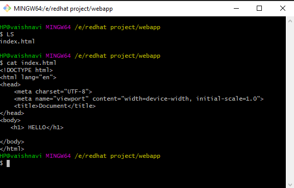

4\. create a dev1 branch by Git branch dev1 and move to dev1 branch by
using git checkout dev1

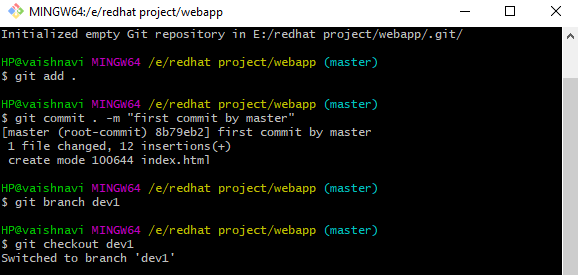6.

5.Edit the code in this branch

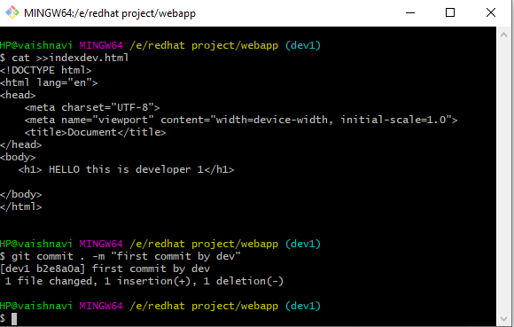. Add 6.and commit the code

Git add.

Git commit -m “message“

Git checkout master

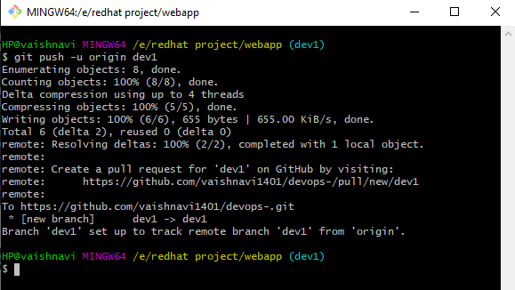

PART 2

Now we need to setup Jenkins for the job

Fire up Jenkins

Step 1:

Create Job1 for production server with following configuration

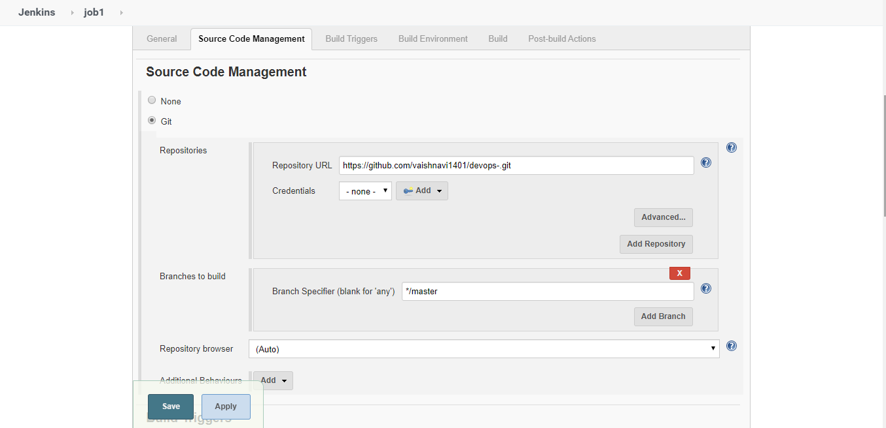

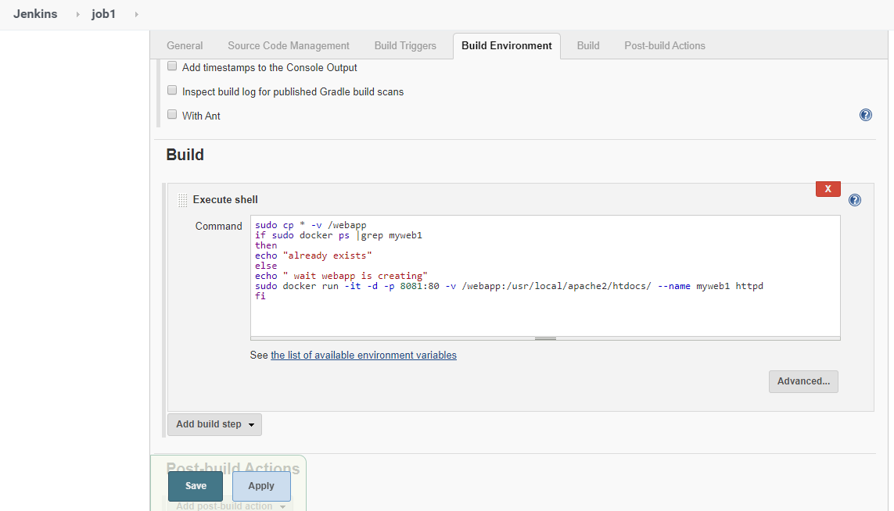

Save the job

STEP 2:

Create another job for development server 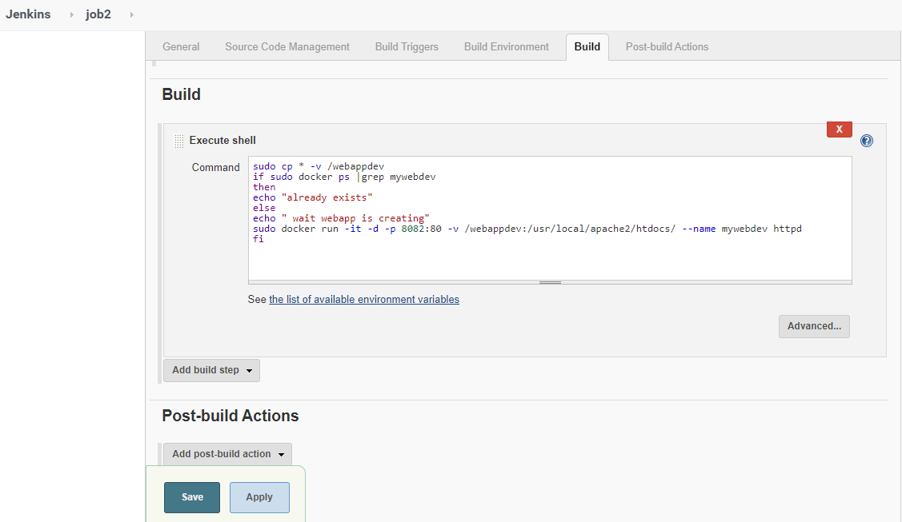

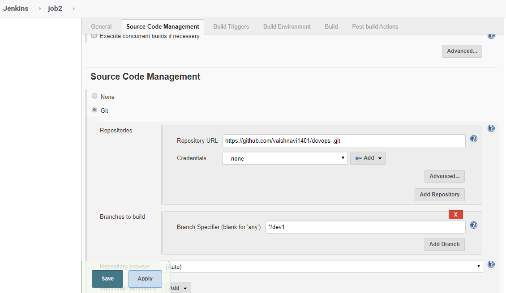

Save the job

Step 3

Create a job QAtesting

Don’t forget to give your credentials here

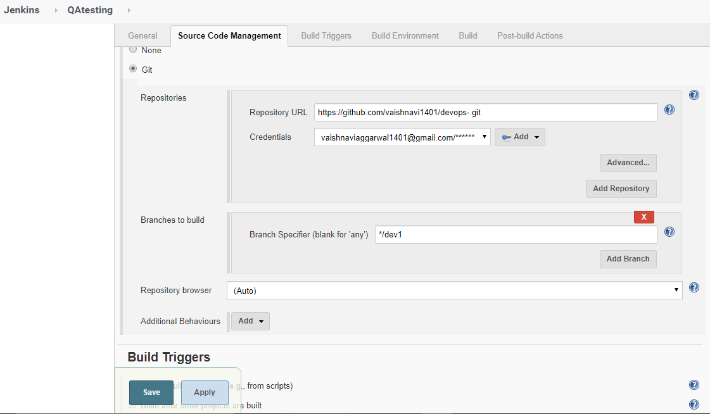

\# go to advanced post build section

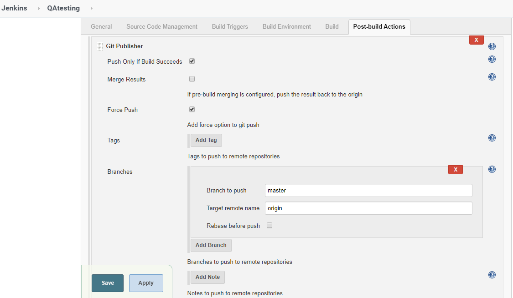

THE TASK HAS BEEN COMPLETED

This is how the index page in branch looks

This is what development server looks like

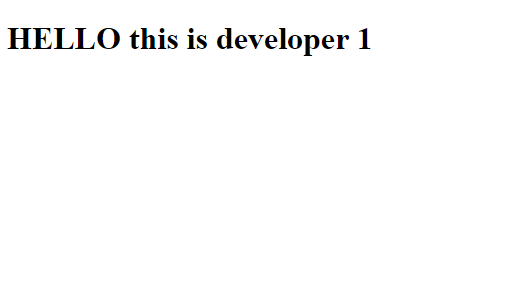

Once the QA team test the code they will start the QATESTING

This is what Docker looks like after this process

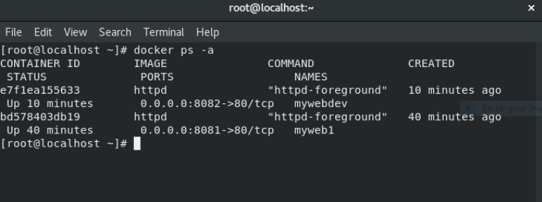
